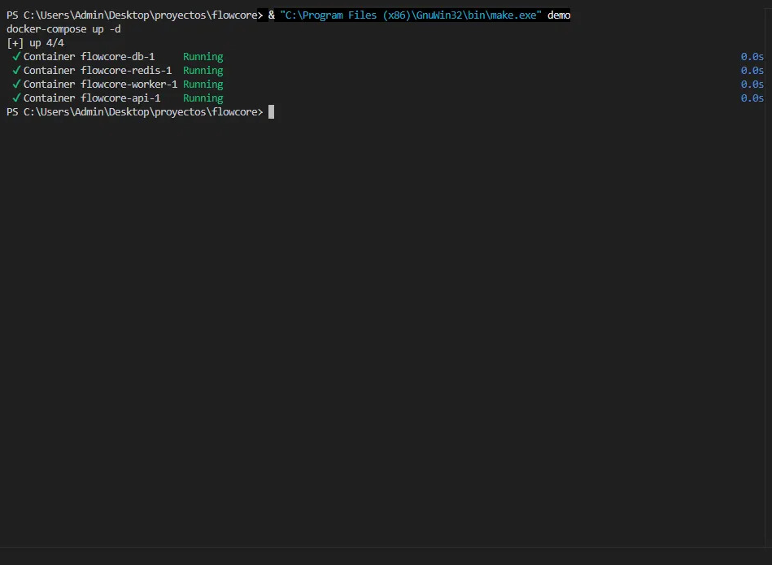
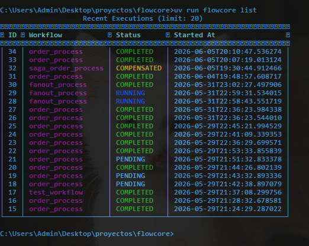
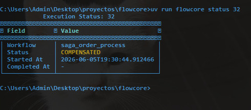
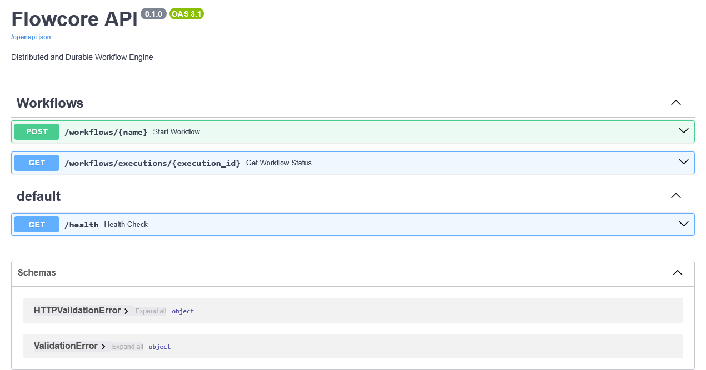
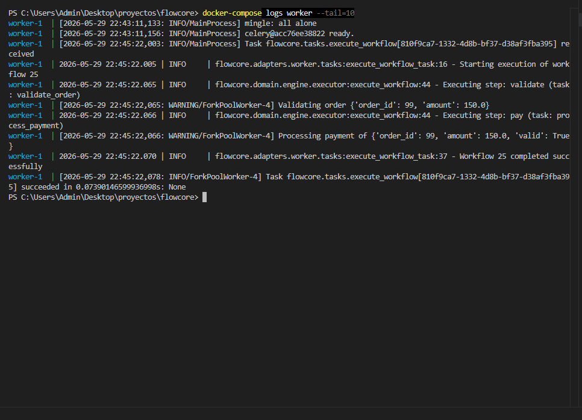
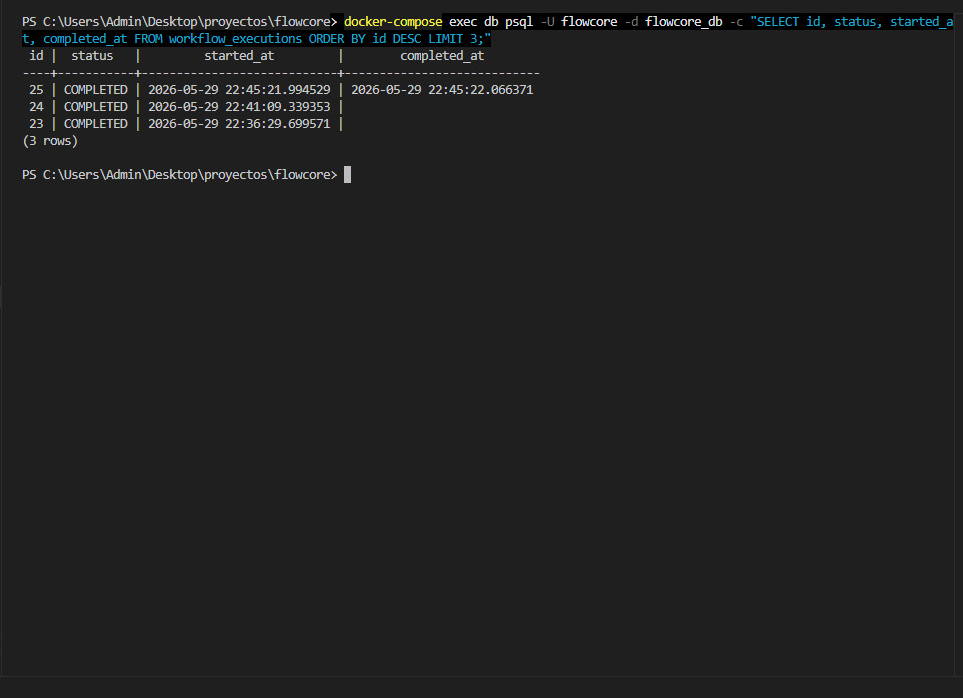
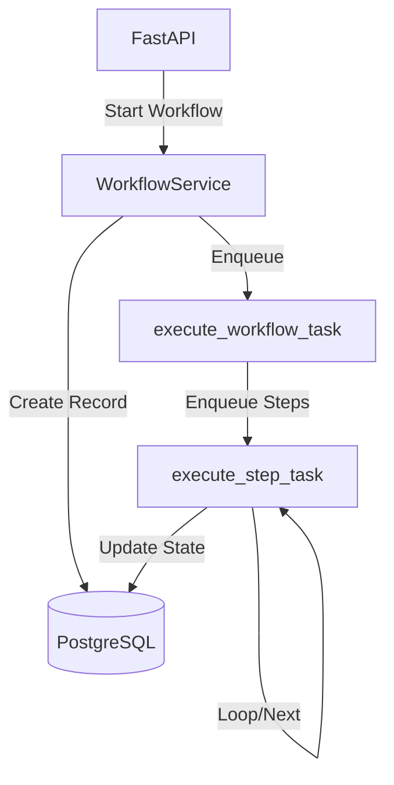
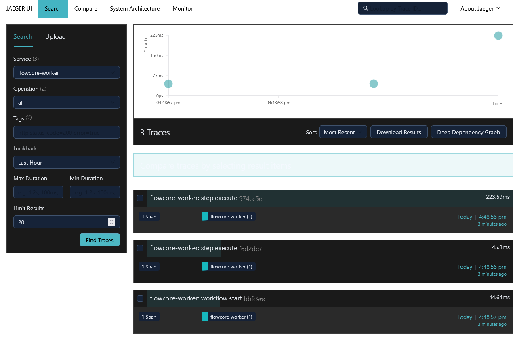

# Flowcore
A distributed and durable workflow engine for Python.

> Built by [Ezequiel Ranieri](https://github.com/ezequielranieri) 
> — Backend & Security Engineer specialized in Distributed Systems

## What is Flowcore?
I built Flowcore to solve a real problem I kept encountering: 
complex business processes that needed to survive failures, resume 
from where they stopped, and scale across workers. Flowcore is a 
lightweight yet powerful workflow execution engine designed to be 
durable and distributed. It allows defining complex business 
processes using an elegant DSL based on Python decorators, ensuring 
reliable step execution with automatic retries and state persistence 
at every transition.

## Quick Demo

```python
from flowcore.domain.dsl.primitives import task, workflow
from flowcore.domain.dsl.models import Step

@task(name="validate_order", max_retries=3)
def validate_order(ctx: dict):
    return {"valid": True}

@workflow(name="order_process", version="1.0.0")
class OrderWorkflow:
    steps = [
        Step(name="validate", task_name="validate_order", next_steps=["pay"]),
        Step(name="pay", task_name="process_payment")
    ]
```

Flowcore allows you to define complex, multi-step workflows in Python using a declarative DSL and execute them in a distributed environment with guaranteed persistence and resilience.

## Quickstart

```bash
# Clone the repository
git clone https://github.com/ezequielranieri/flowcore.git
cd flowcore

# Start the MVP stack
make up

# Apply migrations
make migrate
```

To trigger a real workflow execution, send a request to the API:

```bash
# Using curl
curl -X POST http://localhost:8000/workflows/order_process -H "Content-Type: application/json" -d '{}'

# Or using PowerShell/Invoke-RestMethod
Invoke-RestMethod -Uri http://localhost:8000/workflows/order_process -Method Post -ContentType "application/json" -Body '{}'
```






## API / Quickstart UI
You can visualize and interact with the API endpoints using the Swagger UI.



## Features
- ✅ **Declarative DSL:** Define workflows and tasks with simple decorators.
- 🔍 **Auto-discovery:** Workers automatically discover and register workflow definitions on startup. Zero manual imports required.
- 🕸️ **Real DAG Engine:** Workflow completion uses networkx graph traversal, correctly handling fan-out and complex topologies.
- ⚡ **True Distribution:** Each workflow step runs as an independent Celery task, enabling horizontal scaling across workers.
- 🔀 **Advanced Flow Control:** Support for Fan-out, Branching (conditions), and Join/Barrier (`wait_for`).
- 🔄 **Resilience:** Automatic retries with exponential backoff.
- 🏗️ **Hexagonal Architecture:** Decoupled, testable, and maintainable code.
- 📊 **Full Persistence:** Every execution state is stored in PostgreSQL.
- 🔭 **Distributed Tracing:** Full OpenTelemetry instrumentation with Jaeger. Every workflow and step execution is traced end-to-end.
- 🛡️ **Saga Pattern:** Automatic compensating actions when a step fails. Completed steps are rolled back in reverse order.
- 💻 **Native CLI:** Interact with Flowcore from the terminal using `flowcore run`, `flowcore status`, `flowcore list` and `flowcore workflows`. Rich-formatted tables with color-coded status.




## Why Flowcore?
Flowcore bridges the gap between simple task queues and heavyweight orchestrators.

| Feature | **Flowcore** | Celery | Prefect | Airflow | Temporal |
| :--- | :---: | :---: | :---: | :---: | :---: |
| **Durable Execution** | ✅ | ❌ | ⚠️ | ❌ | ✅ |
| **Low Overhead** | ✅ | ✅ | ❌ | ❌ | ❌ |
| **Native State** | ✅ | ❌ | ✅ | ✅ | ✅ |
| **Learning Curve** | Low | Low | Medium | High | High |

## Stack & Technical Decisions
Every technology choice in Flowcore was made deliberately:
- **Python 3.11+**: Leveraging static typing and performance improvements.
- **uv**: Ultra-fast dependency management.
- **FastAPI**: Modern, asynchronous API framework.
- **Celery 5.5+**: The de-facto standard for distributed tasks in Python.
- **SQLAlchemy 2.0**: Modern declarative style with async support.
- **PostgreSQL**: Reliable and relational persistence.

## Architecture & Concepts







The project follows a **Hexagonal Architecture** (Ports and Adapters):
- **Domain:** Pure business logic (DSL, Engine).
- **Application:** Use cases and orchestration.
- **Infrastructure:** Persistence implementations (SQLAlchemy).
- **Adapters:** Input/Output ports (FastAPI, Celery).

## Key Concepts
- **WorkflowDefinition**: The "blueprint" of the process defined by the user.
- **WorkflowExecution**: A live instance of a workflow currently running.
- **StepExecution**: The individual state of each step, with its input/output data.
- **Registry**: The catalog where definitions reside.

## Project Structure

```text
flowcore/
├── src/
│   └── flowcore/
│       ├── domain/         # Pure logic (DSL, Engine)
│       ├── application/    # Use cases
│       ├── infrastructure/ # DB, Repositories
│       └── adapters/       # API, Worker
├── tests/                  # Test suite
├── migrations/             # Alembic migrations
├── pyproject.toml          # uv configuration
├── Dockerfile              # Optimized image
└── Makefile                # Automation
```

## Known Limitations
- **Single DB Transaction**: Step execution and status updates are not yet part of a single atomic transaction.

## Roadmap

1. Phase 1 (MVP): Basic orchestration, persistence, and initial DSL. ✅ Completed
2. Phase 2: Real distributed step execution. ✅ Completed
3. Phase 3: DAG engine with networkx + auto-discovery. ✅ Completed
4. Phase 4: Observability with OpenTelemetry + Jaeger. ✅ Completed
5. Phase 5: Sagas / Compensating Actions. ✅ Completed
6. Phase 6: Native CLI. ✅ Completed
7. Phase 7: Workflow versioning. (Planned)
8. Phase 8: Multi-tenancy. (Planned)

## Contributing
Contributions are welcome! Please read `CONTRIBUTING.md` for more details on how to get started.

## Author
**Ezequiel Ranieri**  
Backend & Security Engineer | Distributed Systems & Authentication  
📧 ez.ranieri@gmail.com  
🐙 [GitHub](https://github.com/ezequielranieri)  
💼 [LinkedIn](https://www.linkedin.com/in/ezequielranieri)

## License
MIT License.
